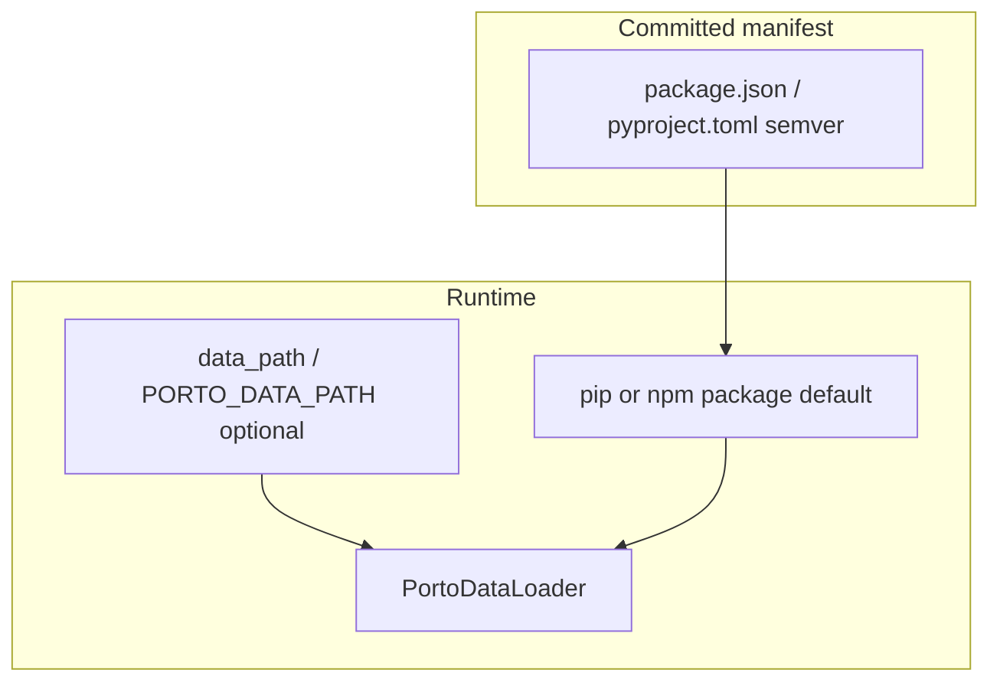

# porto-data and porto-features — SDK dependency model

**Purpose:** How SDKs declare, configure, and load postal catalog data — without Lab path magic in production.

**See also:** [runtime.md](runtime.md) (TS `/browser` embed), [resources.md](../labs/resources.md) (Lab dev overrides), [config.md](config.md) (`PORTO_DATA_PATH`).

---

## 1. Two layers (do not mix them)

| Layer | What it is | Where it lives |
|-------|------------|----------------|
| **Dependency** | Version contract on the catalog package | `package.json` / `pyproject.toml` semver |
| **Runtime instance** | Which catalog root to load on disk (or embed) | `data_path` / `PORTO_DATA_PATH`, or installed package default |

**porto-data is read-only configuration data**, not application persistence. Apps depend on the **SDK**; the SDK depends on **porto-data** as a package. Apps must not parse raw `envelopes.json` or hunt for folders.

**porto-features** is a **test contract** package (BDD scenarios). It is a dev dependency only — not shipped inside the published SDK.

---

## 2. Catalog root vs git repo

The SDK always needs the **catalog root** — the directory that contains `mappings.json`, `providers/`, `policy/`, `formats/`, etc.

In the porto-data git repo that is usually:

```text
porto-data/                 ← git repository
porto-data/porto_data/      ← catalog root (what SDK loaders use)
```

Pass or resolve the **inner** `porto_data/` path, not the repo wrapper.

---

## 3. Production model (integrators and published SDKs)

### Declare dependency (manifest)

| Package | TypeScript | Python |
|---------|------------|--------|
| porto-data | `dependencies`: `@gruncellka/porto-data` | `dependencies`: `gruncellka-porto-data` |
| porto-features | `devDependencies` only | `[project.optional-dependencies].dev` only |

No `file:../../resources/...` in committed manifests. Guards: SDK `make registry` (pre-commit hook `registry`, CI, publish).

### Configure instance (optional override)

```python
# Python — explicit catalog instance
PortoClient(PortoConfig(data_path="/path/to/porto_data", provider="deutschepost"))
# or env: PORTO_DATA_PATH
```

```typescript
// TypeScript Node — explicit or package default
new PortoClient({ dataPath: '/path/to/porto_data', provider: 'deutschepost' })
```

When `data_path` / `dataPath` is **unset**, the SDK uses **package discovery** (below). For production deployments, explicit config or the installed pip/npm package is the normal path.

### Auto-discovery (convenience, not the contract)

The SDK always consumes the **porto-data package**. Installed from PyPI/npm, or overlaid locally (`pip install -e` / `node_modules` symlink). Same import. Same runtime API. No hardcoded Lab path.

**Python** (`find_porto_data_path()` in `porto_data_registry.py`):

1. Installed `gruncellka-porto-data` (`get_package_root()` / package import)

Override via `PortoConfig.data` / `PORTO_DATA_PATH`. The catalog is never copied into the SDK.

**TypeScript Node** (`findPortoDataPath()`):

1. Installed `@gruncellka/porto-data` (package root or `porto_data/` subdir)

Override via `PortoConfig.data` / `PORTO_DATA_PATH`.

**TypeScript `/browser`:**

- Catalog JSON is imported from `@gruncellka/porto-data` at SDK build time (`src/browser/embedded-porto-data.ts`).
- Browser apps never import `@gruncellka/porto-data` at runtime.



---

## 4. Porto SDK Lab (dev-only shortcuts)

Lab co-locates `resources/porto-data` and `resources/porto-features` for cross-repo work. **This does not change how published SDKs work.** SDKs do not detect Lab; Lab overlays from outside.

| Tool | Effect |
|------|--------|
| Lab `make local-resources` | Overlay Lab resource checkouts into both SDK installs (venv editable / node_modules symlinks) — manifests unchanged |
| Lab `make registry-resources` | Restore registry packages in both SDKs |
| SDK `make registry` | Blocks committed local-source dependency specs |

Prefer Lab overlays so the **pip/npm package** points at local data (same code path as production). Tests and runtime resolve the package — they do not walk Lab paths. `PORTO_DATA_PATH` / `PORTO_FEATURES_PATH` are explicit overrides only.

---

## 5. Python tests (`get_porto_data_path()`)

Test helper in `tests/support/porto_features_path.py` — **not** production API. Resolution order:

1. `PORTO_DATA_PATH` (explicit override; invalid values fail)
2. pip `gruncellka-porto-data` (via `find_porto_data_path()`)

Standalone SDK CI and Lab use the same two steps.

---

## 6. Standalone SDK repositories

SDK repos (`porto-sdk-python`, `porto-sdk-typescript`) **do not require** Porto SDK Lab for:

- Manifest deps and lockfiles
- CI / publish (`make registry` + ArtifactContract)
- Runtime for integrators (npm/PyPI)
- TS browser build (npm `@gruncellka/porto-data` JSON imports)

```bash
# TypeScript SDK alone
pnpm install --frozen-lockfile && pnpm run build

# Python SDK alone
pip install -e ".[dev]" && pytest
```

---

## 7. Summary

| Question | Answer |
|----------|--------|
| Normal link to porto-data? | **Manifest semver** + installed package |
| Override which catalog? | **`data_path` / `PORTO_DATA_PATH`** (config, not a mystery folder) |
| Lab `resources/`? | **Dev shortcut** — symlinks or editable pip; never committed in manifests |
| TS `/browser`? | **Build-time embed** — only runtime difference vs Python |
| Folder discovery tricks? | **No** — package resolution, plus optional `PORTO_DATA_PATH` |
